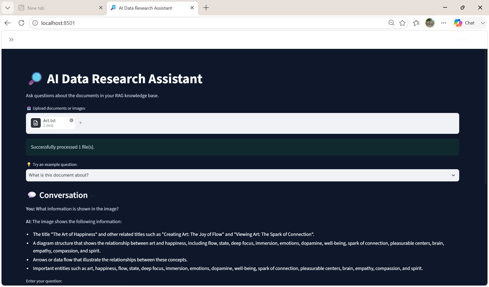

# 🔎 AI Data Research Assistant

An AI-powered research assistant that allows users to upload documents and images, ask questions in natural language, and receive evidence-grounded answers using Retrieval-Augmented Generation (RAG).

The system combines semantic search, multimodal retrieval, Reciprocal Rank Fusion (RRF), LLM-based reranking, and grounded answer generation to retrieve and synthesize relevant information from uploaded content.

## ✨ Features

- 📄 **Multi-format document support** — Upload TXT and PDF documents.
- 🖼️ **Image understanding** — Process images using a vision-enabled LLM.
- 🔎 **Semantic search** — Retrieve relevant content using vector embeddings.
- 🔀 **Multimodal retrieval** — Retrieve text and image-derived evidence separately.
- 🔗 **Reciprocal Rank Fusion (RRF)** — Combine results from multiple retrieval paths.
- 🎯 **LLM-based reranking** — Re-rank retrieved candidates based on question relevance.
- 🤖 **Evidence-grounded generation** — Generate answers using retrieved evidence.
- 💬 **Conversation history** — Maintain context across questions.
- 📑 **Source attribution** — Display the source documents and PDF page numbers.
- 📤 **Multiple file uploads** — Upload and query multiple files in one session.
- 💡 **Example questions** — Quickly try predefined questions or enter custom questions.
- 🎨 **Streamlit interface** — Interactive web interface for document-based research.

## 🏗️ Architecture

The application follows a multimodal Retrieval-Augmented Generation pipeline:

```
                    User Question
                          │
                          ▼
                ┌──────────────────┐
                │ Multimodal       │
                │ Retrieval        │
                └────────┬─────────┘
                         │
              ┌──────────┴──────────┐
              ▼                     ▼
       Text Retrieval        Image Retrieval
              │                     │
              └──────────┬──────────┘
                         ▼
                ┌──────────────────┐
                │ RRF Fusion       │
                └────────┬─────────┘
                         ▼
                ┌──────────────────┐
                │ LLM Reranking    │
                └────────┬─────────┘
                         ▼
                ┌──────────────────┐
                │ Evidence-Grounded│
                │ Answer Generation│
                └────────┬─────────┘
                         ▼
                  Answer + Sources
```    

## 🛠️ Tech Stack

| Category | Technologies |
|---|---|
| Language | Python |
| LLM | Ollama |
| Vision Model | LLaVA-Phi3 |
| Embeddings | Nomic Embed Text |
| RAG Framework | LangChain |
| Vector Database | ChromaDB |
| Retrieval | Semantic Search + Multimodal Retrieval |
| Fusion | Reciprocal Rank Fusion (RRF) |
| Reranking | LLM-based Reranking |
| PDF Processing | PyPDF |
| Frontend | Streamlit |
| Environment & Package Management | uv |

## 📂 Project Structure

```text
AI-Data-Research-Assistant/
│
├── data_dir/
│   ├── document.txt
│   └── diagram.jpeg
│
├── app.py
├── multimodel.py
├── rag.py
├── multidoc.py
├── multivector.py
├── main.py
│
├── pyproject.toml
├── uv.lock
├── req.txt
└── README.md
```

## 🚀 Installation & Setup

### 1. Clone the repository

```bash
git clone <https://github.com/Jovita15-anto/Multimodal-RAG-Research-Assistant.git>
cd AI-Data-Research-Assistant
uv sync
ollama pull llama3.2:latest
ollama pull llava-phi3
ollama pull nomic-embed-text
uv run streamlit run app.py
```
## 💡 How to Use

1. Start the Streamlit application.
2. Upload one or more TXT, PDF, or image files.
3. Select an example question or enter your own question.
4. The system retrieves relevant text and image-derived information.
5. Retrieved results are fused and reranked based on relevance.
6. The LLM generates an evidence-grounded answer.
7. View the source documents and PDF page numbers used for the answer.
8. Continue asking follow-up questions using the conversation history.

### Example Questions

- What is this document about?
- What are the key points discussed?
- What information is shown in the image?
- What are the main concepts discussed?
- How are the text and image related?

## 🖥️ Application Screenshots

### Main Interface

The Streamlit interface allows users to upload documents and images, enter questions, and view AI-generated answers with source attribution.

### Evidence-Grounded Answer

The application displays the generated answer along with the relevant source documents and PDF page numbers.





## 🔄 RAG Workflow

The system processes user queries through the following pipeline:

1. **Upload** — User uploads TXT, PDF, or image files.
2. **Process** — Text is extracted from documents, while images are analyzed using LLaVA-Phi3.
3. **Chunk** — Document content is divided into smaller chunks for efficient retrieval.
4. **Embed** — Text and image-derived descriptions are converted into vector embeddings.
5. **Retrieve** — Relevant text and image evidence are retrieved separately.
6. **Fuse** — Retrieved results are combined using Reciprocal Rank Fusion (RRF).
7. **Rerank** — An LLM evaluates and reranks the retrieved candidates.
8. **Generate** — The final LLM produces an answer based only on the retrieved evidence.
9. **Attribute** — Relevant source files and PDF page numbers are displayed with the answer.

## ⚙️ Configuration

The main models used by the application are configured in `multimodel.py`.

| Component | Model |
|---|---|
| Text LLM | `llama3.2:latest` |
| Vision LLM | `llava-phi3` |
| Embedding Model | `nomic-embed-text` |

The models run locally through Ollama, so the application does not require an external LLM API for its core RAG pipeline.

## 🔮 Future Improvements

Potential improvements for future versions include:

- Support for additional document formats such as DOCX and PPTX.
- Improved multimodal retrieval for complex research documents.
- More advanced reranking techniques.
- Persistent vector-store management across sessions.
- Streaming responses from the LLM.
- Deployment with a cloud-based infrastructure.

## 📄 License

This project is intended for educational and portfolio purposes.